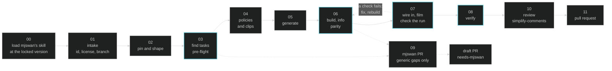

# add-new-task

An agent skill that adds one task to this playground from any repo that registers mjlab tasks, given as a GitHub URL or a local path. The task holds every simulation in that repo that mjswan can run: each mjlab task, or experiment, with a trained policy of its own becomes a scene. The port itself is mjswan's [`mjlab-to-mjswan`](https://github.com/ttktjmt/mjswan/tree/main/skills/mjlab-to-mjswan) skill; this one lands it as `src/mjswan_playground/<task-id>/`, wires it in, reviews the diff and opens a pull request for that task alone.

## Usage

In Claude Code, from the repository root:

```
/msp:add-new-task https://github.com/mujocolab/g1_spinkick_example spinkick
```

The task id is optional; without one, the skill picks a short one like the existing ids. Asking in plain words ("add spinkick to the playground") works too.

The skill ships as a plugin in `.claude/skills/msp/`, which Claude Code loads once you accept the workspace trust dialog. A cloud session never shows that dialog, so add this variable to the cloud environment instead:

```
CLAUDE_CODE_PLUGIN_DIRS=/home/user/mjswan_playground/.claude/skills/msp
```

Any other agent can follow `SKILL.md` directly; it is plain Markdown.

## The pipeline

Step `00` reads mjswan's skill at the version `uv.lock` pins, and its stages run inside these. Four are gates (`03` pre-flight, `06` build and parity, `07` the preview's run check, `08` verify); a run ends in a review and one pull request, or in a stop that says what would unblock it. Filming checks the task in the browser, and a failure sends the port back to `06` until a round is clean.



## What it writes

```
src/mjswan_playground/<id>/
  __init__.py
  main.py          setup_builder(), nothing else
  terms.py         only terms that failed to trace
  upstream.py      the checkout shape, or fetching and converting
  README.md
src/mjswan_playground/registry.py     one line
README.md                             one Tasks row: the preview, and WIP until published
assets/<id>.gif                       the preview
scripts/record_preview.py             its PREVIEWS entry
pyproject.toml, uv.lock               an extra only
```

Nothing else binary is committed: checkpoints, clips and upstream code are fetched at build time from pinned commits into `.cache/`. The preview films in a cloud session too, through `record_preview.py --software`.

## Where it stops

- a dependency conflict on `mujoco` or `mjlab`, reported verbatim;
- a checkpoint or clip that is not published anywhere pinned (a `.pt` on someone's disk);
- an upstream whose env config cannot be adapted: the `husky` / `microduck` shape, proposed but not built;
- a preview whose run still fails its checks after five rounds of fixes;
- in unattended mode, any question the caller left unanswered, or a license the caller's answer does not cover.

These are judged one simulation at a time. A simulation that hits one is left out, and the pull request names it with what would unblock it; the rest still land. Only when no simulation is left does the skill stop, and a stop commits nothing and opens nothing.

## When mjswan itself is missing something

A generic gap becomes a pull request against mjswan, as mjswan's skill says. The task is finished against that PR's commit and waits as a draft labelled `needs-mjswan`; the `released-mjswan` check keeps it off `main`. Once an mjswan release with the change is locked on `main`, the pin is dropped, the task is verified again, and the PR is marked ready. When only some simulations need the change, the rest land without it, and the waiting ones get a draft of their own.

## What it will not do

- Merge anything, or publish to mjswan Cloud: `uv run mjswan publish dist/<id>` is the author's call.
- Put two repositories in one pull request, or one repository in two tasks.
