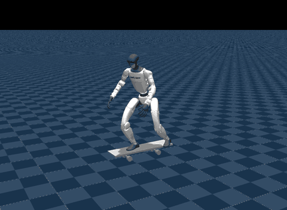
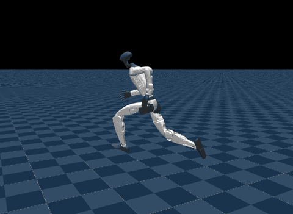
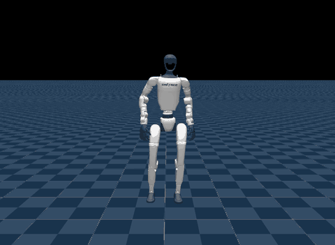

# mjswan playground

A collection of tasks built with [mjswan](https://github.com/ttktjmt/mjswan).

## Tasks

| Task ID | Robot | Description | Preview & Link |
|---------|-------|-------------|----------------|
| [`husky`](src/mjswan_playground/husky/README.md) | Unitree G1 | Skateboarding under whole-body control ([HUSKY](https://husky-humanoid.github.io/), RSS 2026) | <a href="https://mjswan.com/s/oM-paPA"></a><br />[mjswan.com/s/oM-paPA](https://mjswan.com/s/oM-paPA) |
| [`wbc`](src/mjswan_playground/wbc/README.md) | Unitree G1 | One [wbc-mjlab](https://github.com/wbc-mjlab/wbc-mjlab) tracking policy over various motions | <a href="https://mjswan.com/s/XWwo7dV"></a><br />[mjswan.com/s/XWwo7dV](https://mjswan.com/s/XWwo7dV) |
| [`pacman`](src/mjswan_playground/pacman/README.md) | Unitree G1 | Dodging thrown balls from a head depth camera ([PAC-MAN](https://lzyang2000.github.io/perceptive_cbf_rl/), 2026) | <a href="https://mjswan.com/s/GOTofiq"></a><br />[mjswan.com/s/GOTofiq](https://mjswan.com/s/GOTofiq) |
| [`microduck`](src/mjswan_playground/microduck/README.md) | Microduck | Every policy the robot ships: walk, stand, sit, ground pick, ball kick, roulade, roller skate ([Microduck](https://github.com/pollen-robotics/microduck)) | <a href="https://mjswan.com/s/DOGILsh"></a><br />[mjswan.com/s/DOGILsh](https://mjswan.com/s/DOGILsh) |

The previews are filmed from the built apps by [`scripts/record_preview.py`](scripts/record_preview.py): one recipe per task, `--all` to re-record them.

## CLI

```
uv run msp <subcommand>
```

| Subcommand | Description | Options |
|------------|-------------|---------|
| `list` | List the task IDs | none |
| `run <task-id>` | Build a task and open it in the browser | `--host` (`localhost`), `--port` (`8080`), `--no-open`, `--output-dir` |
| `build <task-id>` | Build a task without launching | `--output-dir` |

## Python

mjswan_playground can be imported as a Python package, and each task's builder can be used to build and launch the demo:

```python
import mjswan_playground

builder = mjswan_playground.load("husky")
builder.build(output_dir="dist").launch()
```

Each task also lives at `mjswan_playground.<task_module>.main` (the task ID with underscores, e.g. `mjswan_playground.husky.main`), exposing `setup_builder()`.

## License

This project is licensed under the [Apache-2.0 License](LICENSE).
The upstream assets each task fetches carry their own licenses. Please see each task's README and follow the respective license terms.
