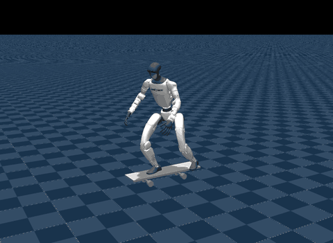
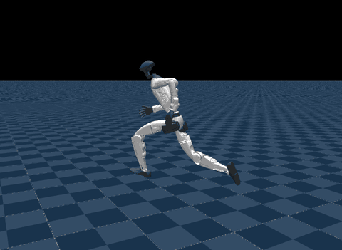
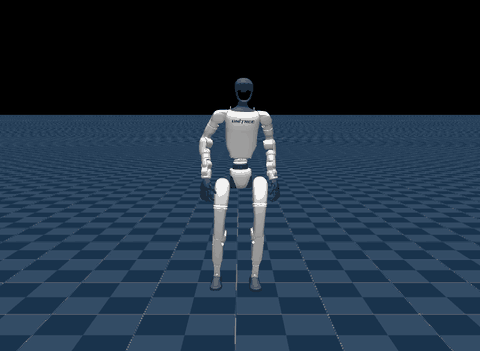
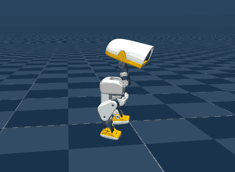
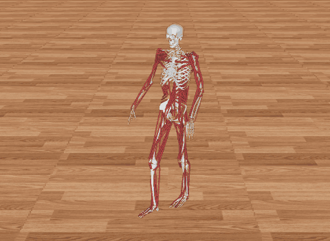
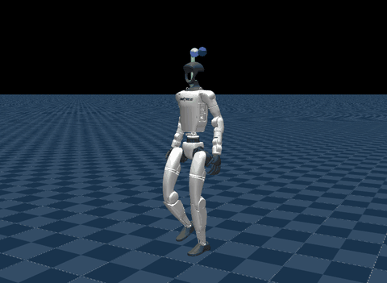

# mjswan playground

<a href="https://github.com/ttktjmt/mjswan_playground/actions/workflows/deploy.yml"></a>

A collection of tasks built with [mjswan](https://github.com/ttktjmt/mjswan).

## Tasks

| Task ID | Robot | Description | Preview & Link |
|---------|-------|-------------|----------------|
| [`husky`](src/mjswan_playground/husky/README.md) | Unitree G1 | Skateboarding under whole-body control ([HUSKY](https://husky-humanoid.github.io/), RSS 2026) | <a href="https://mjswan.com/s/oM-paPA"></a><br />[mjswan.com/s/oM-paPA](https://mjswan.com/s/oM-paPA) |
| [`wbc`](src/mjswan_playground/wbc/README.md) | Unitree G1 | One [wbc-mjlab](https://github.com/wbc-mjlab/wbc-mjlab) tracking policy over various motions | <a href="https://mjswan.com/s/XWwo7dV"></a><br />[mjswan.com/s/XWwo7dV](https://mjswan.com/s/XWwo7dV) |
| [`pacman`](src/mjswan_playground/pacman/README.md) | Unitree G1 | Dodging thrown balls from a head depth camera ([PAC-MAN](https://lzyang2000.github.io/perceptive_cbf_rl/), 2026) | <a href="https://mjswan.com/s/GOTofiq"></a><br />[mjswan.com/s/GOTofiq](https://mjswan.com/s/GOTofiq) |
| [`microduck`](src/mjswan_playground/microduck/README.md) | Microduck | Every policy the robot ships: walk, stand, sit, ground pick, ball kick, roulade, roller skate ([Microduck](https://github.com/pollen-robotics/microduck)) | <a href="https://mjswan.com/s/DOGILsh"></a><br />[mjswan.com/s/DOGILsh](https://mjswan.com/s/DOGILsh) |
| [`musclemimic`](src/mjswan_playground/musclemimic/README.md) | MyoFullBody | A 354-muscle body tracking a walking clip with the public 2.05e9-step checkpoint ([MuscleMimic](https://github.com/amathislab/musclemimic), 2026) | <a href="https://mjswan.com/s/gOrSan8"></a><br />[mjswan.com/s/gOrSan8](https://mjswan.com/s/gOrSan8) |
| [`spinkick`](src/mjswan_playground/spinkick/README.md) | Unitree G1 | A double spin kick motion tracking ([g1_spinkick_example](https://github.com/mujocolab/g1_spinkick_example)) | <a href="https://mjswan.com/s/-wXxa8L"></a><br />[mjswan.com/s/-wXxa8L](https://mjswan.com/s/-wXxa8L) |
| [`bipedhrl`](src/mjswan_playground/bipedhrl/README.md) | Unitree H1-2 | Walking to velocity commands with the checkpoint run on the real robot ([biped_hrl](https://github.com/spaethli/biped_hrl)) | <a href="https://mjswan.com/s/AacPm-T"></a><br />[mjswan.com/s/AacPm-T](https://mjswan.com/s/AacPm-T) |
| [`upkie`](src/mjswan_playground/upkie/README.md) | Upkie | A wheeled biped balancing and driving to velocity commands ([mjlab_upkie](https://github.com/MarcDcls/mjlab_upkie)) | <a href="https://mjswan.com/s/BIPHv2M"></a><br />[mjswan.com/s/BIPHv2M](https://mjswan.com/s/BIPHv2M) |
| [`duet`](src/mjswan_playground/duet/README.md) | Unitree G1 | Walking and squatting down to a 0.18 m crouch ([DUET](https://github.com/bae-air-lab/DUET)) | <br />WIP |
| [`jumper`](src/mjswan_playground/jumper/README.md) | Jumper | A crab robot walking with a commanded body posture, walking on five legs, dancing, gesturing and jumping ([Jumper](https://github.com/KingKongRobotics/jumper)) | <a href="https://mjswan.com/s/7wT9SwQ"></a><br />[mjswan.com/s/7wT9SwQ](https://mjswan.com/s/7wT9SwQ) |
| [`microduckpg`](src/mjswan_playground/microduckpg/README.md) | Microduck | Every experiment of a community playground: running, swing, basketball, stilts, desk and chimney climbs, long jump, backflip ([microduck-playground](https://github.com/Vottivott/microduck-playground)) | <a href="https://mjswan.com/s/_klQQmL"></a><br />Moves: [mjswan.com/s/_klQQmL](https://mjswan.com/s/_klQQmL)<br />Parkour: [mjswan.com/s/mqwst_Y](https://mjswan.com/s/mqwst_Y)<br />Stilts: [mjswan.com/s/qK0Uwr7](https://mjswan.com/s/qK0Uwr7) |
| [`unitreerl`](src/mjswan_playground/unitreerl/README.md) | Unitree G1 | Walking to velocity commands and dancing a LAFAN1 clip, with the checkpoints Unitree ships for deployment ([unitree_rl_mjlab](https://github.com/unitreerobotics/unitree_rl_mjlab)) | <br />WIP |

## CLI

```
uv run msp <subcommand>
```

| Subcommand | Description | Options |
|------------|-------------|---------|
| `list` | List the task IDs, then the parts | none |
| `run <task-id>` | Build a task and open it in the browser | `--host` (`localhost`), `--port` (`8080`), `--no-open`, `--output-dir` |
| `build <task-id>` | Build a task without launching | `--output-dir` |
| `site [<task-id>...]` | Build every task on the GitHub Pages site into one app | `--no-build`, `--base-path` (`/`), `--dist-dir` (`dist`), `--output-dir` (`dist/_site`) |

## Python

mjswan_playground can be imported as a Python package, and each task's builder can be used to build and launch the demo:

```python
import mjswan_playground

builder = mjswan_playground.load("husky")
builder.build(output_dir="dist").launch()
```

Each task also lives at `mjswan_playground.<task_module>.main` (the task ID with underscores, e.g. `mjswan_playground.husky.main`), exposing `setup_builder()`.

## License

This project is licensed under the [Apache-2.0 License](LICENSE).
The upstream assets each task fetches carry their own licenses. Please see each task's README and follow the respective license terms.
