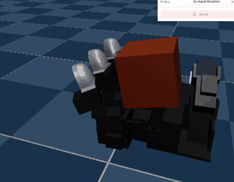

# LEAP in-hand rotation — working prototype

A running browser demo of [Msornerrrr/in-hand-rotation-mjlab](https://github.com/Msornerrrr/in-hand-rotation-mjlab),
built to test the conclusions in [`../../in-hand-rotation-feasibility.md`](../../in-hand-rotation-feasibility.md).
It is **not** wired into the package or CI: it needs mjswan changes that are not
released yet (the patch beside it), so `registry.py` does not know about it.



About 160 s of headless-Chromium wall clock at 16× speed. The fingers gait and the cube
turns continuously; it is never dropped.

## What the mjswan patch adds

`mjswan-relative-joint-position.patch` applies to mjswan `main`. Three of the four
pieces are mjlab parity — features mjlab already has that mjswan did not, none of them
specific to this task. The fourth is not, and is marked as such.

| Change | mjlab parity? |
|---|---|
| `RelativeJointPositionActionCfg` (Python cfg + `joint_position_relative` in `applyAction.ts`) | **Yes** — a direct port of mjlab's own action term, which mjswan did not carry even as a compat stub. |
| `joint_pos_target` in `slotReader.ts` | **Yes** — `Entity.data.joint_pos_target` is a plain mjlab field; any task observing its own position command reads it. Recorded by the action layer, since MuJoCo keeps no such array (`ctrl` holds a post-bias target or a torque). |
| The same field cleared on reset | **Yes** — mjlab's `EntityData.reset` zeroes it. |
| `relative_to="command"` on that term | **No.** mjlab has only the measured-position form. This is the integrator variant (`q_cmd += delta`), the standard delta controller in dexterous manipulation. See below for why it had to exist. |

The target recording is done by every position term, so `joint_position` and
`joint_position_reference` gain the observation too, not just the new one.

`npm test` in `src/mjswan/template`: **373 passing, 11 of them new.**

### Why `relative_to="command"` is not optional here

The two forms are different controllers, not variants of one. Under contact the measured
position lags the command, so an integrator can hold a target the measured-position form
never reaches. `rollout_check.py` runs the ONNX policy in the real mjlab env for 400
steps (20 s) on each:

| action term | cube yaw | rate | dropped |
|---|---|---|---|
| `relative_to="command"` (upstream's) | **−6.10 rad** (0.97 turn) | **−0.305 rad/s** | no |
| `relative_to="position"` (mjlab's) | 0.02 rad | 0.001 rad/s | no |

Upstream's training target for `rotation_progress` was 0.20 rad/s, so the integrator
clears it and mjlab's own term does not rotate the cube at all. The first version of
this prototype ran mjlab's term and looked broken on video for exactly this reason.

### The other bug that made it look broken

`events={}`. mjlab applies an entity's `init_state` through reset **events**, not
automatically — with none, the hand sat at all-zero joints and the cube at the world
origin. Upstream's three reset events, with their randomisation ranges zeroed, are now
stated in `leap_inhand_task.py`.

A related one, invisible on video: the hand's `init_state.joint_pos` had been taken from
the grasp cache's recorded pose. Upstream's cache reset writes the **cube's** size and
pose and nothing else ("Robot joints are not touched"), so the hand always starts at the
fixed `GRASP_INIT_JOINT_POS` — which is also what `joint_pos_rel` subtracts. Using the
cache pose biased 160 of the policy's 320 inputs.

## Running it

```sh
# mjswan checked out beside this directory, patch applied, installed editable
git -C mjswan apply mjswan-relative-joint-position.patch
uv pip install -e ./mjswan "mjlab==1.5.3"

python export_leap_policy.py          # ckpt -> leap_actor.onnx (320 -> 16)
python rollout_check.py --steps 400   # sanity: does the policy rotate the cube?
python build_leap_demo.py             # -> dist-leap/
python capture_leap.py --seconds 150  # headless run -> video/*.webm
python make_gif.py --seconds 10       # -> leap_inhand_rotation.gif
```

`leap_compat.py` and the upstream clone are expected beside these scripts.

## What each file does

| File | Role |
|---|---|
| `leap_compat.py` | Three shims (`DelayedActuatorCfg`, `update_assets`, `TerrainImporterCfg`) so upstream's **robot definition** imports under mjlab 1.5.3. Its task config is not imported. |
| `leap_inhand_task.py` | The task, restated against current mjlab: scene, reset events, the actor's two observation terms, the action, one termination. Registers itself with mjlab's registry so `add_scene_mjlab` can drive it. |
| `export_leap_policy.py` | Actor + empirical normalizer → ONNX, checked against PyTorch. |
| `rollout_check.py` | Rolls the ONNX policy out in the real mjlab env and measures cube yaw, for either action term. The right place to debug a policy — the browser is not. |
| `build_leap_demo.py` | `Builder` → `add_scene_mjlab` → `add_policy` → `dist-leap/`. |
| `capture_leap.py` | Serves the build with COOP/COEP, drives it in Chromium, records video. |
| `make_gif.py` | webm → GIF of a target length. Playwright's bundled ffmpeg muxes only webm, so ffmpeg decodes to PNGs and Pillow does the palette. |

## What is still dropped, deliberately

Domain randomization (observation noise and delay, cube mass/size/friction, actuator
gains and delays), the grasp-cache resampler (the demo bakes one grasp at the nominal
cube size), the stateful pose-deviation termination, and the asymmetric critic.

Rollout fidelity against upstream has **not** been measured term by term — contact-rich
manipulation diverges from any per-step parity, so the honest claim is the yaw rate
above, not trajectory equality.
